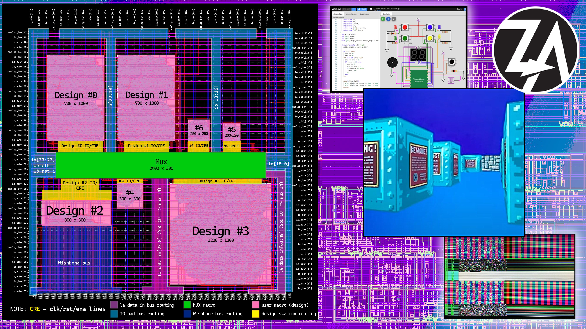
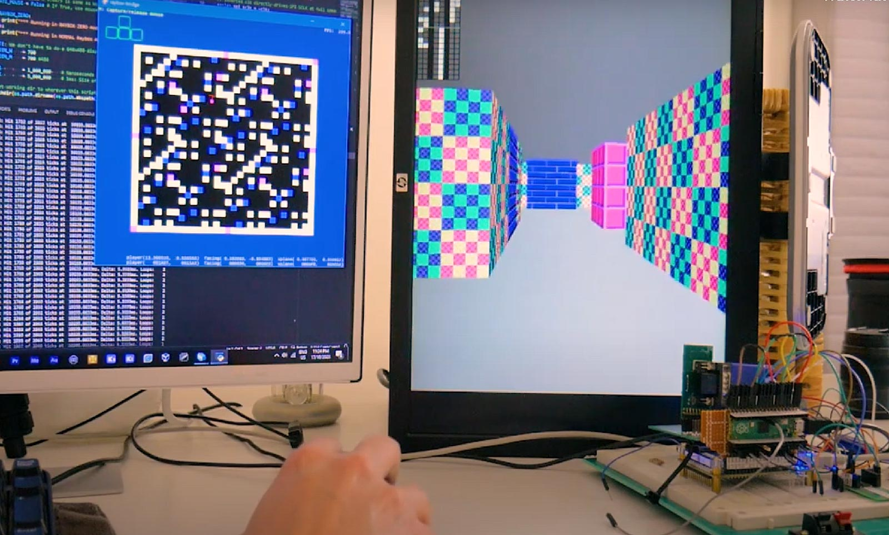

<!--
# SPDX-FileCopyrightText: 2023 Anton Maurovic <anton@maurovic.com>
#
# Licensed under the Apache License, Version 2.0 (the "License");
# you may not use this file except in compliance with the License.
# You may obtain a copy of the License at
#
#      http://www.apache.org/licenses/LICENSE-2.0
#
# Unless required by applicable law or agreed to in writing, software
# distributed under the License is distributed on an "AS IS" BASIS,
# WITHOUT WARRANTIES OR CONDITIONS OF ANY KIND, either express or implied.
# See the License for the specific language governing permissions and
# limitations under the License.
# SPDX-License-Identifier: Apache-2.0
-->

# ztoa-team-group-caravel

[](https://opensource.org/licenses/Apache-2.0)

# Group GFMPW-1 ASIC design organised by "Zero to ASIC" participants



A team of participants from the [Zero to ASIC Course](https://zerotoasiccourse.com) decided to independently assemble this group submission to GFMPW-1 as a way to test/debug/characterise some of their more complex, larger, and experimental designs.

There are 7 designs in this one die, selectable via a mux. **Each of the individual designs is referenced below with a link to its original repo.**

For my comprehensive notes about the journey to get this submitted, [start here with my final journal entry 0189](https://github.com/algofoogle/journal/blob/master/0189-2023-12-11.md) and work backwards by using the 'Previous journal' link atop each page.

This submission is made possible by Google's Open MPW program, the Global Foundries GF180 Open PDK, and Efabless.

## License

This repo is licensed with [Apache 2.0](LICENSE).


## Design 0: top_raybox_zero_fsm - raybox-zero FSM version

By: [algofoogle (Anton Maurovic)] - original repo: [raybox-zero @ gf180-for-mux](https://github.com/algofoogle/raybox-zero/tree/gf180-for-mux)



This project is an attempt to do a minimalist ray caster (Wolf3D-like) VGA renderer in hardware, as a sort of primitive GPU. Earlier, simpler version was previously submitted to be made as part of a community ASIC via the [Tiny Tapeout] program (see [tt04-raybox-zero]).

This version features support for an external SPI memory containing wall texture data, and extra registers for changing the appearance of the rendering. It also has a reworked wall tracer.

For additional documentation and details about the project, please see [algofoogle/raybox-zero](https://github.com/algofoogle/raybox-zero)


## Design 1: 2nd instance of top_raybox_zero_fsm for characterisation

Same as Design 0 above, but with different placement, different routing via mux.


## Design 2: wrapped_wb_hyperram - Wishbone connected HyperRAM memory driver

By: [embelon (Pawel Sitarz)] - Original repo: [wb_hyperram @ 186838b](https://github.com/embelon/wb_hyperram/tree/186838b2605fdc31cdaf1b83afdefef1dd36c42d)

This is an implementation of a HyperRAM memory driver connected to Wishbone bus.

For additional documentation and details about the project, please see [embelon/wb_hyperram](https://github.com/embelon/wb_hyperram)

[embelon (Pawel Sitarz)]: https://github.com/embelon


## Design 3: user_proj_cpu - CPUy 8-bit CPU

By: [dsatizabal (Diego Satizabal)] - original repo: [cpuy](https://github.com/dsatizabal/cpuy)

CPUy is an 8-bits CPU "mind-crafted by experience" and inspired in the AT89S5X series of processors from Atmel which were used by the author at the university to develop microcontrollers projects. The design does not follow any particular well-known architecture for its implementation.

CPUy is meant to be used with an external ROM chip like one of the 27CXXX series that must be flashed with the desired program to be executed supporting a maximum of 4KB of program memory.

The characteristics of CPUy are:

*   10-bits address bus for a maximum external memory of 4096 bytes.
*   8-bits data bus.
*   256 bytes internal scratch pad memory.
*   8 8-bits registers, some used for specific purposes functions as CPU and Timers config.
*   44 supported instructions (arithmetic, logic, branching, movement), some instructions requiring 2 clock cycles and more complex instructions requiring 3 clock cycles for execution.
*   2 bidirectional/configurable I/O ports: P0 8-bits, P1 4-bits.
*   2 16-bits timers with configurable mode (up/down count), autoreload and interrupt.
*   1 dedicated pin for external interrupt.
*   16-levels LIFO stack.
*   Combinational-logic ALU and microcode.

For additional documentation and details about the project, please see [dsatizabal/cpuy](https://github.com/dsatizabal/cpuy)

[dsatizabal (Diego Satizabal)]: https://github.com/dsatizabal


## Design 4: urish_simon_says - Simon Says game for GFMPW-1 Shuttle

By: [urish (Uri Shaked)] - original repo: [gfmpw1-simon-says @ gds_north](https://github.com/urish/gfmpw1-simon-says/tree/gds_north)

Simon says is a simple electronic memory game: the user has to repeat a growing sequence of colors. The sequence is displayed by lighting up the LEDs. Each color also has a corresponding tone.

In each turn, the game will play the sequence, and then wait for the user to repeat the sequence by pressing the buttons according to the color sequence. If the user repeated the sequence correctly, the game will play a "leveling-up" sound, add a new color at the end of the sequence, and move to the next turn.

The game continues until the user has made a mistake. Then a game over sound is played, and the game restarts.

You can play the game using the online Wokwi simulation at https://wokwi.com/projects/371755521090136065. The simulation also shows the wiring diagram.

For additional documentation and details about the project, please see [urish/gfmpw1-simon-says](https://github.com/urish/gfmpw1-simon-says)

[urish (Uri Shaked)]: https://github.com/urish


## Design 5: top_solo_squash

By: [algofoogle (Anton Maurovic)] - original repo: [solo_squash @ main](https://github.com/algofoogle/solo_squash)

This is a Verilog HDL project that implements a primitive digital-logic-based video game that resembles Pong, but with one player just bouncing a ball within a 3-walled space, resembling a game of [squash](https://en.wikipedia.org/wiki/Squash_(sport)) but with just 1 paddle. It also uses a subset of the vertical timing to produce speaker tones for different game states.

For additional documentation and details about the project, please see [algofoogle/solo_squash](https://github.com/algofoogle/solo_squash)


## Design 6: top_vga_spi_rom

By: [algofoogle (Anton Maurovic)] - original repo: [tt05-vga-spi-rom @ main](https://github.com/algofoogle/tt05-vga-spi-rom)

This is an experiment to see if we can generate a VGA display that uses a constant stream of data from an external SPI ROM, demonstrating a few specific goals:

*   Have an option to switch between timing for a 640x480 VGA display and a 1440x900 VGA display using the same source clock.
*   Have alternating modes that switch between registered and unregistered output.
*   Alternate between Quad SPI mode and single SPI mode.
*   Attempt to demonstrate any actual IO, memory, and other logic delays visually.

For additional documentation and details about the project, please see [algofoogle/tt05-vga-spi-rom](https://github.com/algofoogle/tt05-vga-spi-rom)


## Mux, including other internal 'test designs'

For documentation on controlling the mux, see: [Using LA pins to control the mux](https://github.com/algofoogle/journal/blob/master/0187-2023-12-09.md#using-la-pins-to-control-the-mux)


# Hardening guide

>   NOTE: The original repo with all development progress branches can be found on GitHub: https://github.com/algofoogle/algofoogle-multi-caravel
>   
>   All work branches from `gf180-base`, which in turn is a simpler[^1] 'template-like' base that branches from [efabless/caravel_user_project's `gfmpw-1d` tag](https://github.com/efabless/caravel_user_project/tree/gfmpw-1d).

<!-- footnote: -->
[^1]: For more info, see: [0181 &sect; 'What I did'](https://github.com/algofoogle/journal/blob/master/0181-2023-12-02.md#what-i-did).

Here's a very high-level overview of hardening any given design, assuming you already have at least *something* of a working OpenLane environment (or at least the prerequisites installed; see [the original efabless guide](https://github.com/efabless/caravel_user_project/blob/gfmpw-1c/docs/source/index.rst) for more info, but note that the PDK version in that doco might be outdated):

> NOTE: Zero to ASIC VM also redirects certain other things (`MGMT_AREA_ROOT`, `DESIGNS`, `CARAVEL_ROOT`, etc. to subdirectories of `~/asic_tools/caravel_user_project`). Check your `~/.bashrc` for details. I've been trying to make this a bit more flexible (see [Tip 2312A](https://github.com/algofoogle/journal/blob/master/tips/2312A.md) point 5) but note that I've not completed this work yet.

1.  Switch to the branch you want (default for the submission is `gf180`) set it up for the first time:

    ```bash
    git checkout gf180
    mkdir -p dependencies
    # Changing OPENLANE_ROOT & PDK_ROOT optional if using Zero to ASIC VM:
      export OPENLANE_ROOT=$(pwd)/dependencies/openlane_src
      export PDK_ROOT=$(pwd)/dependencies/pdks
    # Required:
    export PDK=gf180mcuD
    # This will download and install caravel, the PDK, required OpenLane version, etc.
    make setup
    ```

2.  Each time you want to harden:

    ```bash
    # Optional, as above:
      export OPENLANE_ROOT=$(pwd)/dependencies/openlane_src
      export PDK_ROOT=$(pwd)/dependencies/pdks
    # Required:
    export PDK=gf180mcuD

    # MAIN HARDENING STEP:
    make top_design_mux
    ```

3.  To harden all:

    ```bash
    make top_design_mux         \
         top_raybox_zero_fsm    \
         top_solo_squash        \
         top_vga_spi_rom        \
         urish_simon_says       \
         user_proj_cpu          \
         wrapped_wb_hyperram    \
         user_project_wrapper
    ```

NOTE: The final `user_project_wrapper` harden is expected to end with reporting hold violations. These are intentional: They relate specifically to *secondary* reset lines connected to the designs, each controlled by a separate `la_data_in[]` pin. While other more-stable system-wide reset options are provided, these are intended for specific experimentation/characterisation.

[Tiny Tapeout]: https://tinytapeout.com
[tt04-raybox-zero]: https://github.com/algofoogle/tt04-raybox-zero
[algofoogle (Anton Maurovic)]: https://github.com/algofoogle
