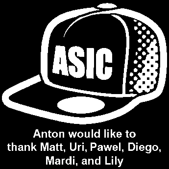

# Tholin's `logo_gen` (image-to-GDS converter)

This is a pair of scripts borrowed from here: https://github.com/AvalonSemiconductors/gfmpw1-multi/tree/cb9a1ee73967b7b1b0af307714f44025d43e7572/logo_gen

That code is part of an [Apache-2.0-licensed](https://github.com/AvalonSemiconductors/gfmpw1-multi/blob/main/LICENSE) repo, and I have permission from Tholin (the original author) to include it in this repo.

The purpose of this code is to convert a black-and-white (1-bit palette) PNG image to a GDS/LEF pair that can be included as a macro.



## Usage

```bash
./logo_gen.sh SOURCEIMAGE TARGETMACRO
```

Where:

*   `SOURCEIMAGE` is a PNG file (300~500px width recommended)
*   `TARGETMACRO` is the name of the macro that will be generated: .gds and .lef output, placed in the respective parent directories.

With the current default settings inside [Logo_Gen.java](./LogoGen.java), white pixels of the source image become filled with GF180's `Metal4` while black pixels become empty space.

The script also places power/ground (`vdd`/`vss`) pins per hard-coded X/Y positions (in source image pixel coordinates relative to the top-left corner of the PNG image). These are required to avoid LVS errors in the OpenLane flow, though they are otherwise unused.

You might want to edit `Logo_Gen.java` to change the following to suit your requirements:

```java
int scale = 18;
int gndx = 129;
int gndy = 36;
int powerx = 320;
int powery = 191;
int portSize = 100;
```

## Notes

There are other things to consider that I haven't documented in full yet, but here are some pointers:

*   Make sure you place the coordinates of vdd/vss over large enough areas of white pixels.
*   Ensure those areas of pixels that will hence become the vdd/vss nets are not shorted with each other, i.e. they are islands of white pixels.
*   Ensure those respective areas of white pixels cover enough vertical area that they can cross the actual PDN rails.
*   Avoid very small clusters of white pixels (esp. avoid individual white pixels, and probably also black pixels) because these might lead to DRC errors.
*   Create a blackbox wrapper Verilog file for the macro in `verilog/rtl/`
*   Add the macro and its related files in all the relevant areas. For example, check the contents of this repo to look for `asic_hat_logo` throughout the following:

    *   [lvs/user_project_wrapper/lvs_config.json](../lvs/user_project_wrapper/lvs_config.json)
    *   [openlane/user_project_wrapper/config.json](../openlane/user_project_wrapper/config.json)
    *   [openlane/user_project_wrapper/macro.cfg](../openlane/user_project_wrapper/macro.cfg)
    *   [verilog/gl/user_project_wrapper.v](../verilog/gl/user_project_wrapper.v)
    *   [verilog/includes/includes.gl.caravel_user_project](../verilog/includes/includes.gl.caravel_user_project)
    *   [verilog/includes/includes.rtl.caravel_user_project](../verilog/includes/includes.rtl.caravel_user_project)
    *   [verilog/rtl/user_project_wrapper.v](../verilog/rtl/user_project_wrapper.v)
    *   [verilog/rtl/asic_hat_logo.v](../verilog/rtl/asic_hat_logo.v)

